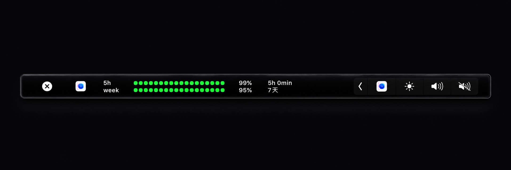

# Codex Quota Touch Bar

[中文说明](README.zh-CN.md)

A small personal macOS menu bar and Touch Bar utility for showing local Codex quota state.

It reads Codex rate-limit data from the local Codex app-server when available, then falls back to the latest local Codex session JSONL file.

## Preview



## Features

- Menu bar status with the 5-hour and weekly Codex quota percentages.
- Touch Bar Control Strip / system tray button.
- Tap the Touch Bar button to open a compact two-row quota panel.
- Local countdown display for reset time.
- Optional custom app icon source image with a red-to-green quota-style ring.

## What It Reads

The app tries these sources in order:

1. Local Codex app-server:
   ```sh
   codex app-server --listen stdio://
   ```
2. Latest local Codex session JSONL under:
   ```text
   ~/.codex/sessions
   ```

It automatically looks for Codex in:

1. `/Applications/Codex.app/Contents/Resources/codex`
2. `~/.vscode/extensions/openai.chatgpt-*/bin/macos-x86_64/codex`
3. `which codex`

## UI

Menu bar:

```text
5h 93% W 96%
```

Touch Bar expanded panel:

```text
[x] [icon]  5h    ||||||||||||||||||||  93%   4h 12min
            week  |||||||||||||||||||||  96%   3天
```

If the weekly reset is less than one day away, it is shown as hours and minutes.

## Build

Requirements:

- macOS with Command Line Tools
- `clang`
- `node`
- `sips`

Build:

```sh
./build.sh
```

The app is created at:

```text
build/CodexQuotaTouchBar.app
```

You can copy it to:

```text
/Applications/CodexQuotaTouchBar.app
```

## Optional Icon Asset

This repository does not need to include any official Codex/OpenAI artwork.

If you want to build with your own local icon image, place it here:

```text
Assets/codex.webp
```

The build script will use that image inside a red-to-green ring. If the file is missing, the app builds with a simple generated `C` mark instead.

`Assets/codex.webp` is intentionally ignored by git.

## Privacy

This app does not send model prompts and does not consume Codex model quota.

It reads local account/rate-limit metadata from Codex app-server and may read local session JSONL files as a fallback. It does not upload those files.

## Important Limitations

This project uses private macOS Touch Bar APIs, including system tray and modal Touch Bar selectors. These APIs are not documented by Apple and may stop working after macOS updates.

This app is intended for personal use and is not suitable for App Store distribution.

## Trademark Notice

This project is not affiliated with OpenAI. Codex, OpenAI, ChatGPT, macOS, and Touch Bar are trademarks of their respective owners.

Do not redistribute third-party brand artwork unless you have the right to do so.
